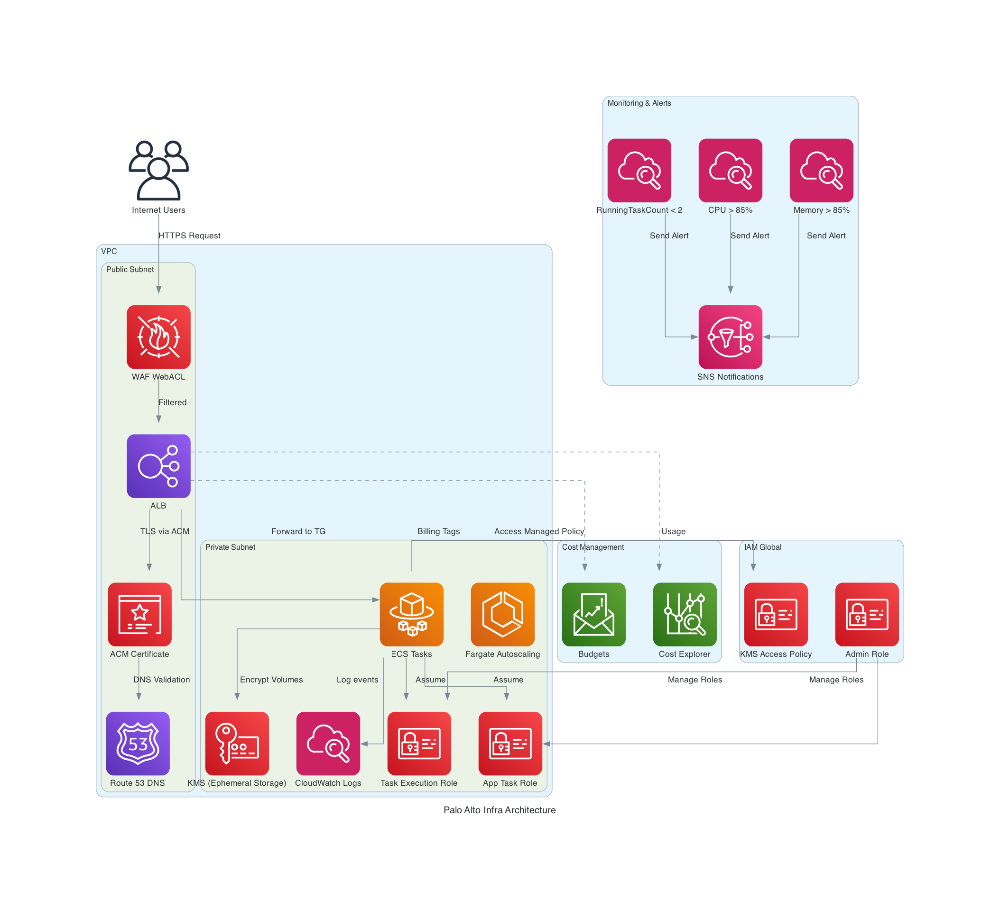

#  Palo Alto Web Infrastructure — Terraform on AWS

This repository defines a secure, production-grade AWS infrastructure for deploying a **stateless containerized web application** using **ECS Fargate**. The stack includes integrated monitoring, security controls, cost governance, and follows AWS best practices.

---

##  Architecture Overview



The infrastructure is composed of the following core components:

- **VPC with public and private subnets**: Isolates ALB from ECS service tasks.
- **Application Load Balancer (ALB)**: Public entry point, TLS terminated via ACM, protected by AWS WAF.
- **ECS Fargate**: Serverless container runtime for the stateless application.
- **KMS Key**: Encrypts ephemeral storage used by ECS containers.
- **IAM Roles**: Provides scoped permissions for execution and application tasks.
- **CloudWatch**: Logs ECS tasks and triggers alarms based on metrics.
- **SNS**: Sends alarm notifications to subscribers.
- **Cost Management**: Budgets and Cost Explorer allow tracking and enforcing spending.
- **Route 53**: Handles DNS and validation for ACM certificates.

---


##  Module Structure

```
.
├── .github/
    ├── workflows/
        ├── terraform.yml
├── modules/
│   ├── acm/
│   ├── cloudwatch-alarms/
│   ├── ecs/
│   ├── iam/
│   ├── kms/
│   ├── security-groups/
│   ├── vpc/
├── infrastructure/
    └── test-env/
        ├── main.tf
        ├── variables.tf
        ├── outputs.tf
        └── backend.tf
```

---

##  Getting Started

### 1. Install Dependencies

```bash
brew install terraform graphviz
pip install diagrams
```

### 2. Deploy the Infrastructure

```bash
cd infrastructure/test-env
terraform init
terraform plan
terraform apply
```

---

##  Monitoring & Alerts

CloudWatch alarms are configured for:

- **CPUUtilization > 85%**
- **MemoryUtilization > 85%**
- **RunningTaskCount < 2**

These send notifications to an **SNS Topic**, which you can subscribe to via email or integrate with Slack, OpsGenie, etc.

---
## Enable the SSL for LB
⚠️ ACM Certificate and Route 53 Validation Note
To enable HTTPS using ACM on the Application Load Balancer, you must complete the following steps:

Configure Route 53 to host the domain used in your ACM certificate (e.g., example.com).
This is necessary for ACM to perform DNS-based validation of the certificate.

Once your Route 53 zone is correctly set up and delegation is in place:

Uncomment the ACM certificate validation block in:

h
Copy
Edit
resources/acm/main.tf
This includes the aws_route53_record and aws_acm_certificate_validation resources used for automatic DNS validation.

Enable the ALB listener on port 443 and associate it with the ACM certificate ARN.

If the ACM certificate is not successfully validated:

Terraform will fail when trying to create the ALB listener on port 443.

You will get an error like:

javascript
Copy
Edit
Error: InvalidCertificate: The certificate ARN provided has not been validated.

---
##  Security Overview

| Component        | Hardening Strategy |
|------------------|---------------------|
| **ALB**          | Protected by **WAF** and exposed only via HTTPS |
| **ECS Tasks**    | Placed in **private subnets**, no public IPs |
| **KMS**          | Encrypts ephemeral storage for containers |
| **IAM**          | Roles are limited to the minimum required actions |
| **ACM**          | Uses **DNS validation** via Route 53 for automation |

---

##  Cost Control

The infrastructure includes:

- **Budgets**: Define usage limits per environment.
- **Cost Explorer**: Integrated via tagging.
- **Cost and Usage Reports** (CUR): Can be added via module.

All resources are tagged with `Environment`, `Project`, and `ManagedBy` to enable cost breakdowns.

---

##  GitHub Actions Setup

This repository includes a GitHub Actions workflow to automatically validate and plan your Terraform infrastructure on every push or pull request to `main`.

### Required Secrets

You must configure the following GitHub repository secrets:

- `AWS_ACCESS_KEY_ID`
- `AWS_SECRET_ACCESS_KEY`

To add them:

1. Go to your repository on GitHub.
2. Click on `Settings` → `Secrets and variables` → `Actions`.
3. Add the two secrets listed above using valid AWS credentials with Terraform permissions.

These are used by the CI pipeline in `.github/workflows/terraform.yml` to authenticate Terraform commands against your AWS account.


